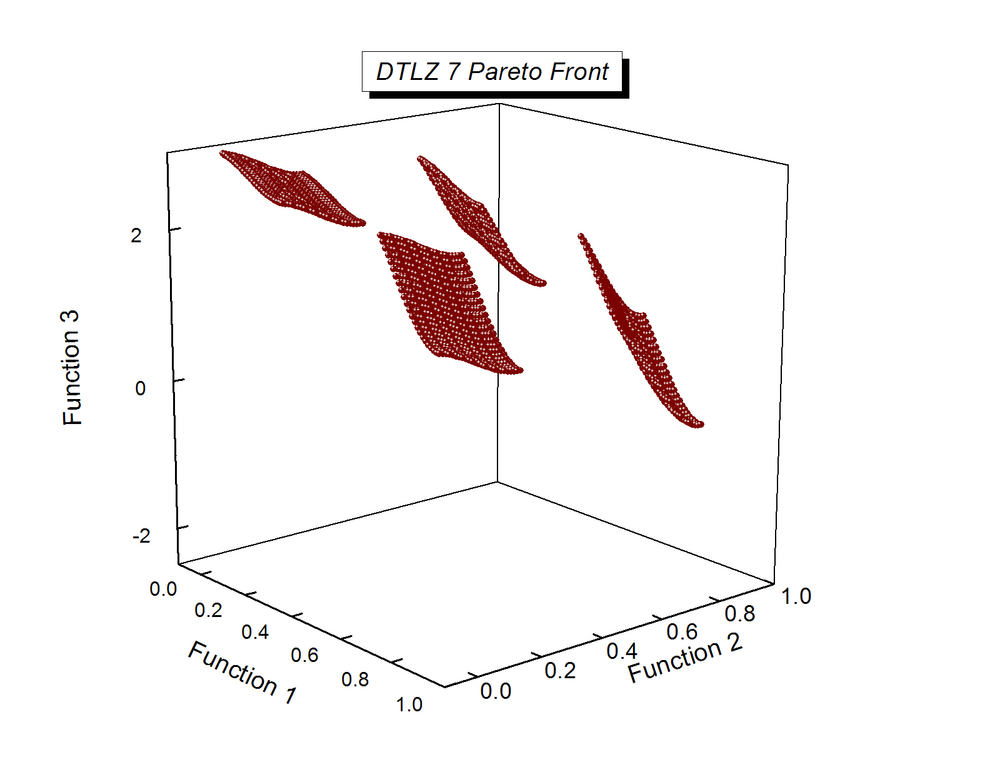
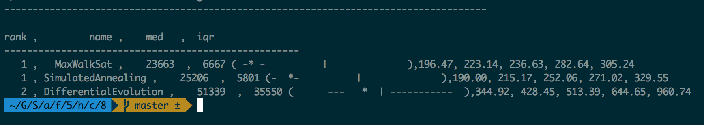

## Code 8 : Comparing MaxWalkSat, Simulated Annealing and Differential Evolution for DTLZ7 

## Team Members 
*  Akond Rahman (aarahman@ncsu.edu)
*  Bennett Narron (bynarron@ncsu.edu) 
*  Manish Singh (mrsingh@ncsu.edu)
 

##Abstract

There are various algorithms available today which help us find solutions which meet our optimization goals for numerous real-world problems that we are exposed to. However, there is a difference in the performance of these algorithms for various problems or models they are tested or applied on. It becomes important to find out which algorithm is doing better, what are the limitations if any and finally be able to decide which algorithm to use for any given problem at hand. In this report, we compare three well-known search-based algorithms : *MaxWalkSat, Simulated Annealing and Differential Evolution* by testing all three on [DTLZ7] (http://e-collection.library.ethz.ch/eserv/eth:24696/eth-24696-01.pdf) model which has two objectives and ten decisions. We use the loss between the initial era and the final era of each optimizer as a metric to do the comparison.

**Keywords**: Differential Evolution, Simulated Annealing, MaxWalkSat, Search-based Optimization

##I. Introduction:

For comparing the three optimization algorithms - Simulated Annealing, MaxWalkSat and Differential Evolution, we have used [DTLZ7] (http://e-collection.library.ethz.ch/eserv/eth:24696/eth-24696-01.pdf) model which has **two objectives and ten decisions**.
  
**Simulated Annealing** : This is a stochastic search algorithm where you initially start with any random solution and then keep improving the algorithm as the number of iterations increases. This can be related to annealing of metals where sudden rise or drop of temperature can make the metal brittle. So, at high temperature, simulated annealing has high probability of accepting a not-so-good solution but as the temperature comes down, the probability of accepting a bad solution decreases and it slowly becomes greedy and converges to a satisfying optimization solution.  

**Differential evolution**: This is a method that optimizes a problem by iteratively trying to improve a candidate solution with regard to a given measure of quality.Such methods are commonly known as metaheuristics as they make few or no assumptions about the problem being optimized and can search very large spaces of candidate solutions. However, metaheuristics such as DE do not guarantee an optimal solution is ever found.

**MaxWalkSat** : This is a non-parametric stochastic based method for sampling the landscape of the region. The intuition here is that if you know the shape of the problem well, you will do better in reaching your goals. With some probability p, it will do random search and with (1-p) probability it will do greedy search. This way the algorithm is able to do well in exploring the landscape and finding the regions which optimize our goal.

In order to compare the above algorithms , we use three types of comparisons which are called three types of [less than](https://github.com/txt/mase/blob/master/lessthan.md):
  
**Comparison Type1**: This comparison is done between candidate pairs. It is used for finding the better candidate between candidate pairs. If candidate "X" is better than candidate "Y", "X" is selected. 
 
**Comparison Type2**: This comparison is done between between two eras for early termination of the algorithm. The intuition here is that if there is no improvement in the new era when compared with the previous era, then we need not do the later iterations. In order to be sure about no change, the termination can be done if there is no improvement in the era for say - n iterations ( which can be tuned as required )
  
**Comparison Type3**: This comparison is done between the sets of candidates generated from different optimizers. The final eras of each optimizer can be compared by collecting performance statistic such as :

+ HyperVolume
+ Spread
+ Loss


**DTLZ7** : This model :[DTLZ7] (http://e-collection.library.ethz.ch/eserv/eth:24696/eth-24696-01.pdf) has two objectives and ten decisions. The above algorithms were tested and compared using this model.

### Related Work 

There have been some studies in different domains of science and engineering, as well as research studies that have investigated software quality and software defects and used various approaches for comparison. 

Rocca et al. [5] conducted a survey on use of different variants of DE in computational electromagnetics. They studied 70 academic papers between 2000 and 2009 and found that _DE/best/1/bin_ was the most used variant of DE used in the domain of computational electromagnetics. 

Talukder et al. [6] used DE to optimize schedulers in grid computing. The authors studied two parameters _execution time_, and _data transmission time_ through simulation. The authors claimed DE performs better that the _Pareto-archived Evolutionary Strategy (PAES)_ algorithm for this particular problem. 

Liao [7] analyzed how two hybrid approaches of DE compare to the classical version of DE in the context of an engineering design problem. In the first hybrid approach, random walk is incorporated the classical version of DE. In the second, he included harmony search to the basic differential algorithm. Liao studied 14 engineering design problems including non-linear programming problems, manufacturing design problem, and non-linear chemical engineering problems. For all the 14 engineering design problems the two hybrid approaches outperformed the classical DE in terms of convergence rate.

This project aims on implementing and comparing three well-known optimizers namely, Simulated Annealing (SA), Max Walk Sat, and Differential Evolution (DE) on DTLZ7

  

##II. Implementation:

We implemented Differential Evolution, Simulated Annealing and MaxwalkSat to perform optimization on DTLZ7 model(with 2 objectives and 10 decisions)

***Pseudo code for [Simulated Annealing](https://github.com/txt/mase/blob/master/SA.md)***

```
s := s0; e := E(s)                  // Initial state, energy.
sb := s; eb := e                    // Initial "best" solution
k := 0                              // Energy evaluation count.
WHILE k < kmax and e > emax         // While time remains & not good enough:
  sn := neighbor(s)                 //   Pick some neighbor.
  en := E(sn)                       //   Compute its energy.
  IF    en < eb                     //   Is this a new best?
  THEN  sb := sn; eb := en          //     Yes, save it.
        print "!"
  FI
  IF    en < e                      // Should we jump to better?
  THEN  s := sn; e := en            //    Yes!
        print "+"                        
  FI
  ELSE IF P(e, en, k/kmax) < rand() // Should we jump to worse?
  THEN  s := sn; e := en            //    Yes, change state.
        print "?"
  FI
  ...
  print "."
  k := k + 1                        //   One more evaluation done    
  if k % 50 == 0: print "\n",sb
RETURN sb                           // Return the best solution found.
```

***Pseudo Code for [MaxWalkSat Algorithm](https://github.com/txt/mase/blob/master/MWS.md)***

```
    FOR i = 1 to max-tries DO
      solution = random assignment
      FOR j =1 to max-changes DO
        IF  score(solution) > threshold
            THEN  RETURN solution
        FI
        c = random part of solution 
        IF    p < random()
        THEN  change a random setting in c
        ELSE  change setting in c that maximizes score(solution) 
        FI
    RETURN failure, best solution found
```

***Pseudo Code for [Differential Evolution](https://github.com/txt/mase/blob/master/DE.md)***

```
FOR i = 1 to max-tries DO
  solution = random assignment
  FOR j =1 to max-changes DO
    IF  score(solution) > threshold
        THEN  RETURN solution
    FI
    c = random part of solution 
    IF    p < random()
    THEN  change a random setting in c
    ELSE  change setting in c that maximizes score(solution) 
    FI
RETURN failure, best solution found
```

***DTLZ7*** **Model:**  



**[Steps](https://github.com/txt/mase/blob/master/STATS.md) for comparing the above search-based algorithms:**  
1. Visualize the data.  
2. Check if the central tendency of one distribution is better than the other; e.g. compare their median values.  
3. Check the different between the central tendencies is not some small effect.  
4. Check if the distributions are significantly different.  

For step3, we used a12 method to determine the effect size.
We repeated this experiment twenty times, i.e, each algorithm was run 20 times to optimize DTLZ7 model and then their final eras were compared to determine the rank. 

**Note**: We did two such experiments : 

+ Run the experiment to find the best baseline . Each algorithm produced best baseline after twenty iterations and the next algorithm used this baseline as starting point to further improve the same.
+ Use the best baseline produced at the end of the above experiment. Keep this baseline constant throughout this experiment across all three algorithms to serve as a common platform for comparison.

The final eras for all three optimizers was stored and passed to scottknott, sk.py, to generate chart with rank of each optimizers.
We used rdiv list to store the final eras and passed it to rdivDemo method.

##III. Results

Below are the results on running Simulated Annealing,MaxWalkSat and Differential Evolution algorithms 20 times on DTLZ7 model:

####First Era:
```
** Simulated Annealing  on  DTLZ_7 **
Best solution = [0.008590984312559669, 0.15396150201062964, 0.2740664338031239, 0.494679753985397, 0.1253814570083921, 0.4014028921692314, 0.6042391363546722, 0.2420510949371717, 0.4845727216192197, 0.02526877831161689] ... best energy =8.41212854148e-07, corresponding objectives: first 0.00859098431256, second 9.05630073775. Number of steps taken = 240


** MaxWalkSAT  on  DTLZ_7 **
Best solution = [0.1793198654601369, 0.003979886969854407, 0.006121307061895065, 0.09320370545020706, 0.5384159184631134, 0.06606688924246473, 0.04385745731114077, 0.14236893068464918, 0.1560895145470209, 0.42433621915037656] ... best energy =4.58391240927e-07, corresponding objectives: first 0.17931986546, second 6.6194012999. Number of steps taken = 316

** Differential Evolution  on  DTLZ_7 **
Energy .... 1.21657977084e-14: [0.8256859903809929, 0.7334096354906645, 0.9976893442903592, 0.9131737457979481, 0.9950778131389603, 0.937678626861347, 0.5421497826705823, 0.7580207387200931, 0.09027439755969069, 0.7941355446021054]
After running the optimizer ... BASELINE: MIN= 3.46428478421e-07  MAX= 24103063.053

```
####Last Era:

```
** Simulated Annealing  on  DTLZ_7 **
Best solution = [0.18028245533354126, 0.4266964503058407, 0.2705332218395994, 0.7157250184464258, 0.27142221746437656, 0.1388584274988236, 0.34611308103136673, 0.21009668401712667, 0.5027872409146945, 0.13578505781379757] ... best energy =8.88841768325e-07, corresponding objectives: first 0.180282455334, second 9.39785719312. Number of steps taken = 220


** MaxWalkSAT  on  DTLZ_7 **
Best solution = [0.07829521555819907, 0.043987093763277696, 0.09352628082576442, 0.07103493460330434, 0.6353374412192523, 0.054201295099146285, 0.03878869870452428, 0.6864497233122336, 0.018340636788155756, 0.5362170542441705] ... best energy =5.39954869501e-07, corresponding objectives: first 0.0782952155582, second 7.93015300554. Number of steps taken = 316


** Differential Evolution  on  DTLZ_7 **
Energy .... 1.51520171399e-14: [0.35947347022582565, 0.8563978304639265, 0.685802170967325, 0.45503859564982574, 0.8625916968877669, 0.5973272185734276, 0.8606983430742836, 0.2629354215767151, 0.7849561180056208, 0.9477101000421396]
After running the optimizer ... BASELINE: MIN= 3.02711056942e-07  MAX= 24103063.053
```
#### Rank of DE, MWS and SA optimizers

```
rank ,         name ,    med   ,  iqr
----------------------------------------------------
   1 ,   MaxWalkSat ,    23663  ,  6667 ( -* -          |              ),196.47, 223.14, 236.63, 282.64, 305.24
   1 , SimulatedAnnealing ,    25206  ,  5801 (-  *-          |              ),190.00, 215.17, 252.06, 271.02, 329.55
   2 , DifferentialEvolution ,    51339  ,  35550 (      ---   *  | -----------  ),344.92, 428.45, 513.39, 644.65, 960.74
```

**Detailed Console Output File :** [ConsoleOutput](outputLog.txt)

**Screenshot of Rank Output**:

##IV Conclusions

We had chosen loss statistic to compare the different algorithms for our experiment. As per this statistical measure, the best algorithm would be the one which maximises the loss between the first era and the final era. As we can see from the population distribution of the above algorithms, Differential Evolution has the maximum loss observed between the first era and the final era. It is ranked three in terms of loss statistic because ScottKnott assumes that smaller it is, the better. The other two algorithms - MaxWalkSat and Simulated Annealing have the same performance on DTLZ7.

##V. Threats to validity

+ This experiment involved twenty different baseline runs for each optimizer algorithm. We have observed consistent results for the various runs we did for testing the program and hence we believe that twenty runs should be sufficient enough for generating enough population data to do the comparison among the algorithms.
+ We have set the patience value to 10 for early termination. This means that if we do not see any improvement in the new era for ten consecutive eras, then we stop the algorithm. We have also tested this for values greater than 10 and we did not find any deviation from our results.
+ Since our experiment is based on DTLZ7 model, the configurations we used may not be the best ones for models whose degree of complexity is much higher than DTLZ7. The user of this framework would have to tune these values based on the model performance. However, we believe that models which are as complex as DTLZ7 or simpler than that should work fine with this framework.


##VI. Future Work

+ This experiment can be used to test these algorithms for any other model by simply plugging the model in the model class.
+ This experiment provides a ready to use framework for testing and plugging these three algorithms.
+ This framework can be used to compare any algorithm by simply plugging the required algorithms and models respectively into the framework.
+ The current work could be scaled up and optimized further by running the second experiment in parallel to cut down on execution time.
+ In this experiment, we used loss statistic as a measure to compare different optimizers. This work can be extended by using other measures such as ***hypervolume*** and ***spread*** to compare the optimizers. 

##VII. References

[1] [Dr. Tim Menzies Course Website](https://github.com/txt/mase/blob/master/README.md)

[2] [DTLZ7 Information](http://www.tik.ee.ethz.ch/~sop/download/supplementary/testproblems/dtlz7/index.php)

[3] [DTLZ7 Pareto Frontier Information](http://mcis.jsu.edu/faculty/agarrett/ecspy/reference.html)

[4] [DTLZ7 Model Image Source](http://mcis.jsu.edu/faculty/agarrett/ecspy/reference.html)

[5] P. Rocca, G. Oliveri, and A. Massa, "Differential Evolution as Applied to Electromagnetics," in IEEE Antennas and Propagation Magazine, vol.53, no.1, pages 38-49, February, 2011

[6] A. Talukder, M. Kirley, and R. Buyya, "Multiobjective Differential Evolution for Scheduling Workflow Applications on Global Grids", in Journal of Conncurrency & Computation, pages 1742-1756 vol. 21 no. 13, September 2009

[7] T. Liao, "Two Hybrid Differential Evolution Algorithms for Engineering Design Optimization", in Applied Soft Computing, vol. 10, no. 4, pages 1188-1199, September, 2010


##VIII. Acknowledgement

We would like to thank **[Dr. Tim Menzies](https://github.com/timm)** for giving us an opportunity to learn and explore various problems and algorithms in the domain of search-based algorithm. Further, we would also like to thank the **Teaching Assistant** for the course - **[Mr.Rahul Krishna](https://github.com/rahlk)** for answering all our queries and guiding us throughout. 

